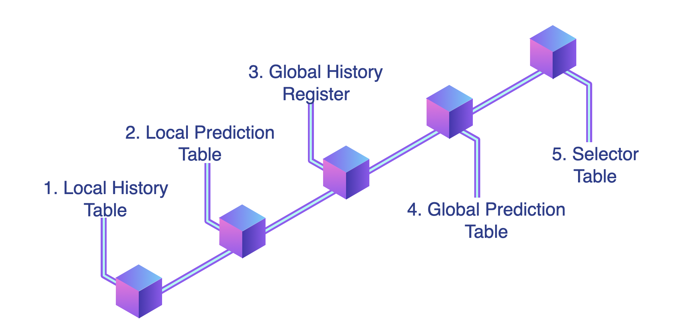
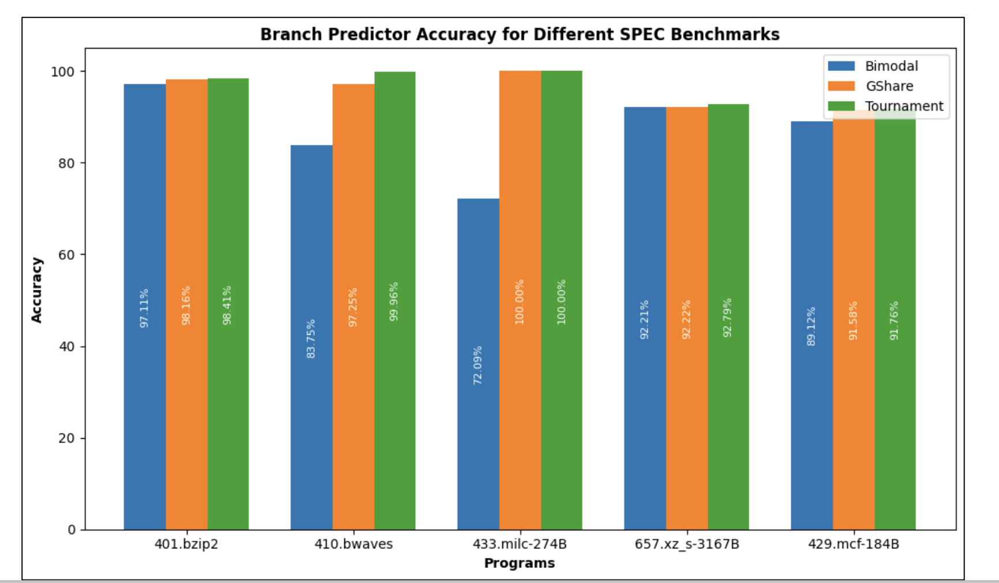
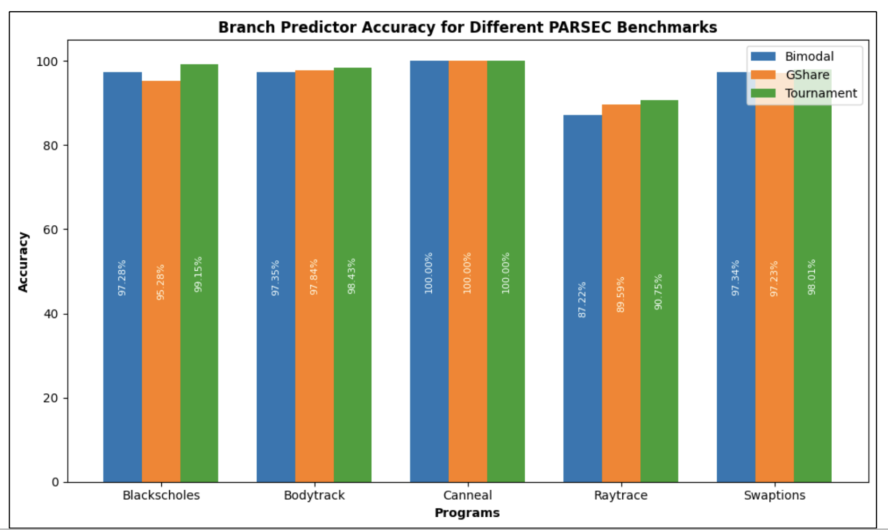

# Analysis on Tournament Branch Predictor
Implemented Tournament Branch Predictor and integrated it with existing ChampSim codebase. SPEC and PARSEC benchmarks are used for evaluation of the predictor. 

## Architecture

<p align ="center">
  
  <em></em>
</p>

## Run

- Download ChampSim from [here](https://github.com/ChampSim/ChampSim).
- Download ChampSim older version from [here](https://drive.google.com/file/d/1L1d9Lb8agS4Olc5dp_uKEYJ9OtUrwkmt/view?usp=sharing).

- Download Benchmarks [SPEC](https://dpc3.compas.cs.stonybrook.edu/champsim-traces/speccpu/) and [PARSEC](https://mega.nz/folder/hp1wCRBI#TlHy4GKlEHW-Eyk4AfwBZA)

- Place the **tournament.bpred** in **/ChampSim/branch**.

- Place the downloaded benchmarks in **/ChampSim/dpc3_traces**.

- Build the ChampSim simulator.

```
./build_champsim.sh tournament no no no no lru 1
```

- Run the ChampSim with specified configuration on different benchmarks.

```
./run_champsim.sh tournament-no-no-no-no-lru-1core 1 13 403.gcc-16B.champsimtrace.xz
```

## Results
Following are some results. 

- SPEC

<p align ="center">
  
  <em></em>
</p>

- PARSEC

<p align ="center">
  
  <em></em>
</p>
